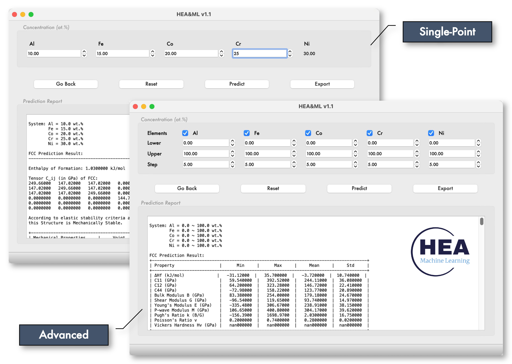
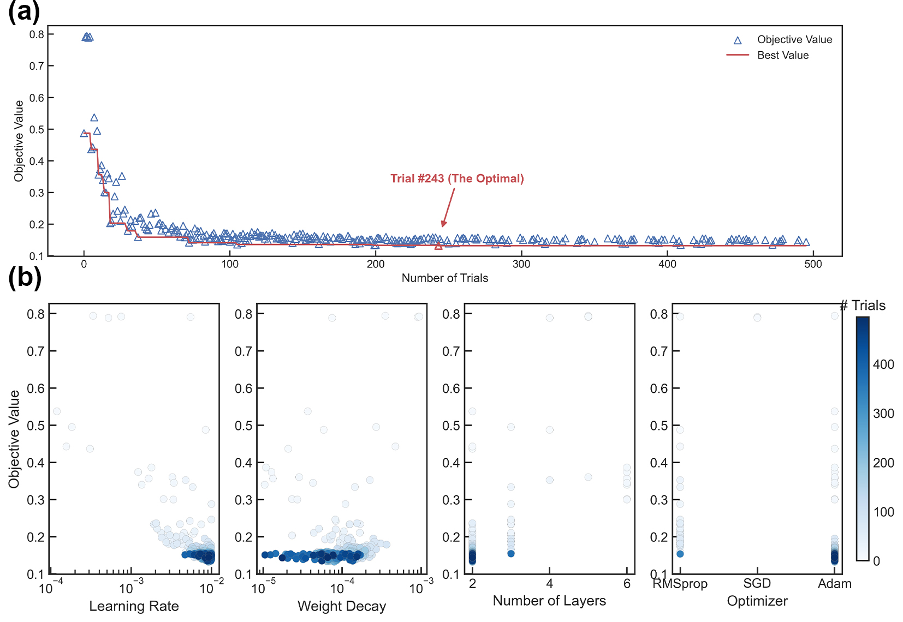
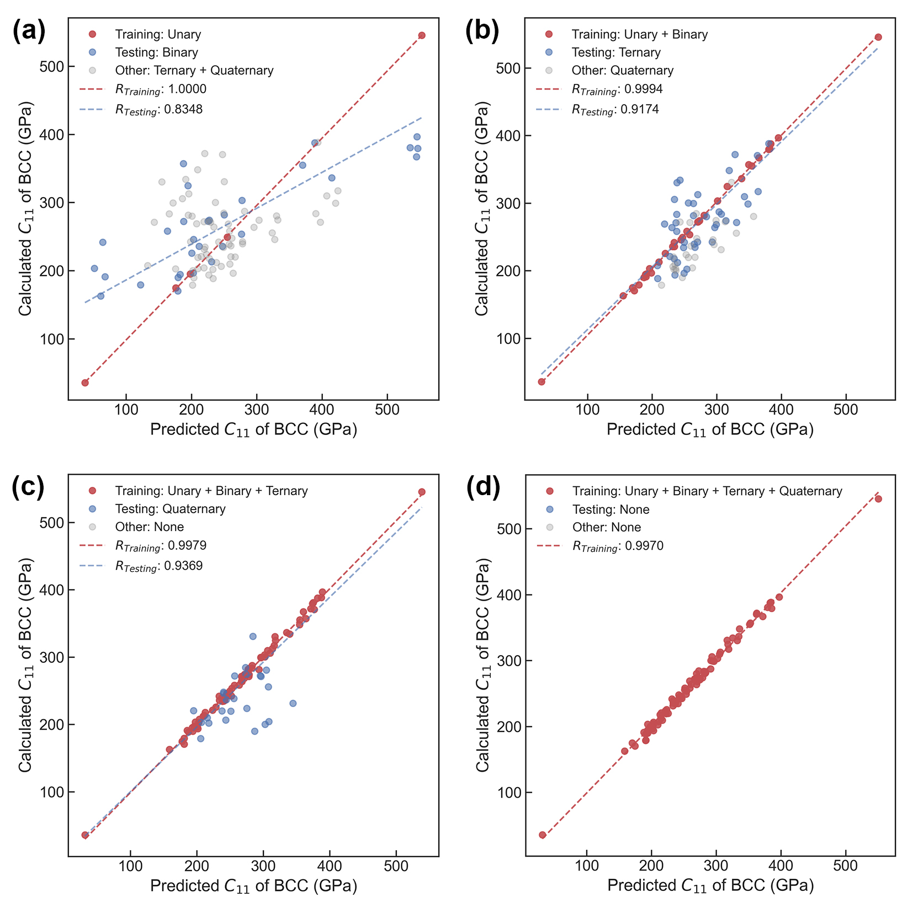
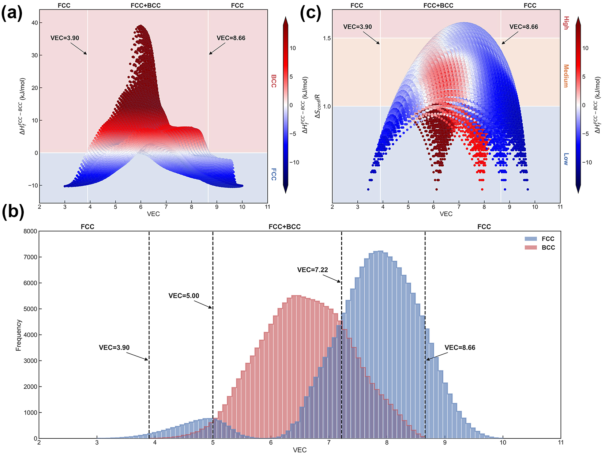
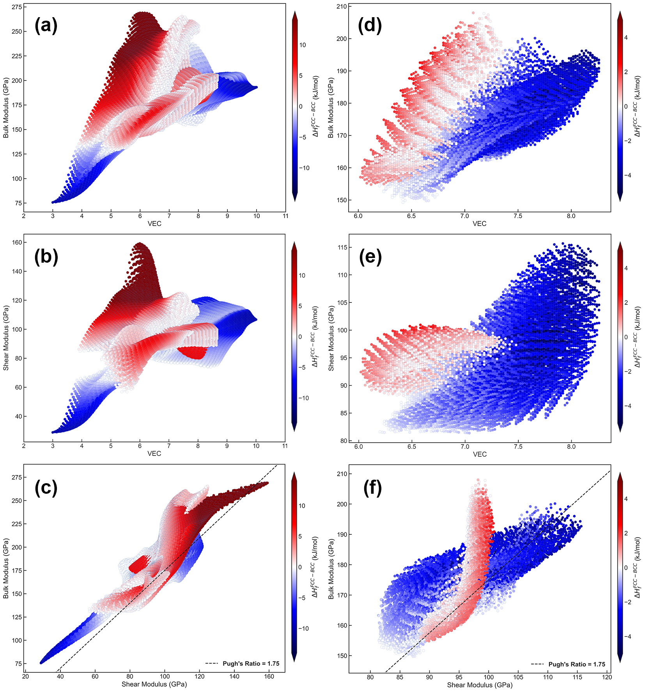
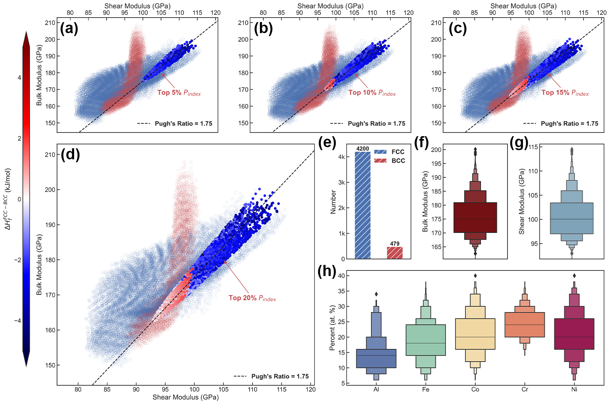
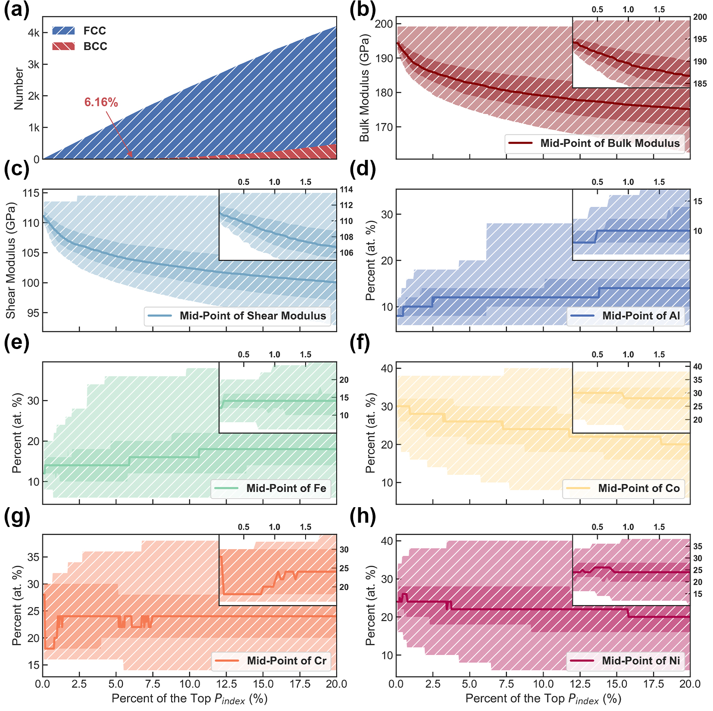

# High-Entropy Materials Design by Integrating the First-Principles Calculations and Machine Learning: a Case Study in the Al-Co-Cr-Fe-Ni System

## Overview
High-entropy alloys (HEAs) have drawn significant attention within the materials science community due to their exceptional properties. However, optimizing compositions in these alloys is challenging due to their vast compositional space. Conventional computational methods are constrained by high computational costs, limiting rapid database expansion. In this study, we propose a novel approach that integrates first-principles calculations with machine learning to efficiently explore the Al-Co-Cr-Fe-Ni system, encompassing both face-centered cubic (FCC) and body-centered cubic (BCC) phases. Our approach establishes comprehensive relationships among compositions, phase stability, and elastic properties at 0 K. A comprehensive database and software for this system are developed. Analysis of this database reveals the presence of FCC and BCC phases under specific valence electron concentration (VEC) criteria. Through screening and statistical analysis using a performance index, we quantitatively investigate the brittleness and ductility, facilitating the identification of optimal HEAs candidates. This work enhances our understanding of the HEA properties, offering a promising pathway for materials design and optimization.

## Workflow

## Get Started
### Download
* Visit https://github.com/aguang5241/HEA_ML/releases to download the demo version of software (Windows, MacOS are supported). *For full version of software, please contact us (gliu4@wpi.edu; yzhong@wpi.edu)*.

### Usage Description
1. Two search modes are available: *Single-Point* and *Advanced*.

    

2. On the *Single-Point* page, you can calculate the predicted properties based on the exact given concentration.

    

3. On the *Advanced* page, you can calculate and analyze the predicted properties based on certain given conditions.

    

## Main Results
### Modeling
* Results of algorithm-driven modeling: (a) optimization history; (b) Optimization results for learning rate, weight decay, number of layers, and optimizers.

    

### Training
* A 4-step progressive training approach: (a) unary training and binary testing; (b) unary + binary training and ternary testing; and (c) unary + binary + ternary training and quaternary testing; (d)  Fine-tuning and experimental verifications.

    

### Prediction
* The relationship between the VEC and $\Delta H_{f}^{FCC-BCC}$: (a) phase stability, (b) configurational entropy, and (c) statistical frequency of FCC and BCC.

    

* The predicted values of bulk moduli, shear moduli, and Pugh’s ratio for the whole composition range are shown in figures (a), (b), and (c), respectively, while figures (d), (e), and (f) show the elastic properties within the criteria of HEAs (i.e., $\Delta S_{conf}/R ≥ 1.5$).

    

### Analysis & Screening
* Screening and analysis results within the (a) top 5% $P_{index}$, (b) top 10% $P_{index}$, (c) top 15% $P_{index}$, and (d) top 20% $P_{index}$. (e) The number of FCC and BCC candidates. Statistical distribution of (f) bulk moduli, (g) shear moduli, and (d) concentrations of Al, Fe, Co, Cr, and Ni under the top 20% $P_{index}$.

    

* Evolution of the HEA candidates: (a) number of the FCC and BCC candidates; (b) bulk moduli; (c) shear moduli; (d) concentration of Al; (e) concentration of Fe; (f) concentration of Co; (g) concentration of Cr; (h) concentration of Ni.
    
    

## Cite Us
1. Liu, Guangchen, Songge Yang, and Yu Zhong. "High-Entropy Materials Design by Integrating the First-Principles Calculations and Machine Learning: A Case Study in the Al-Co-Cr-Fe-Ni System." High Entropy Alloys & Materials (2024): 1-14. ([**This Work**](https://doi.org/10.1007/s44210-024-00041-3))
2. Our HEA-ML database for high entropy alloys elastic property predictions was reported in [**JOM**](https://static.asminternational.org/amp/202303/21/).
3. S. Yang, G. Liu, Y. Zhong, Revisit the VEC criterion in high entropy alloys (HEAs) with high-throughput ab initio calculations: A case study with Al-Co-Cr-Fe-Ni system, Journal of Alloys and Compounds  (2022) 165477.
4. S. Yang, Y. Zhong, Ab Initio Modeling of fcc Fe-Co-Cr-Ni High Entropy Alloys with Full Composition Range, Journal of Phase Equilibria and Diffusion 42(5) (2021) 656-672.
