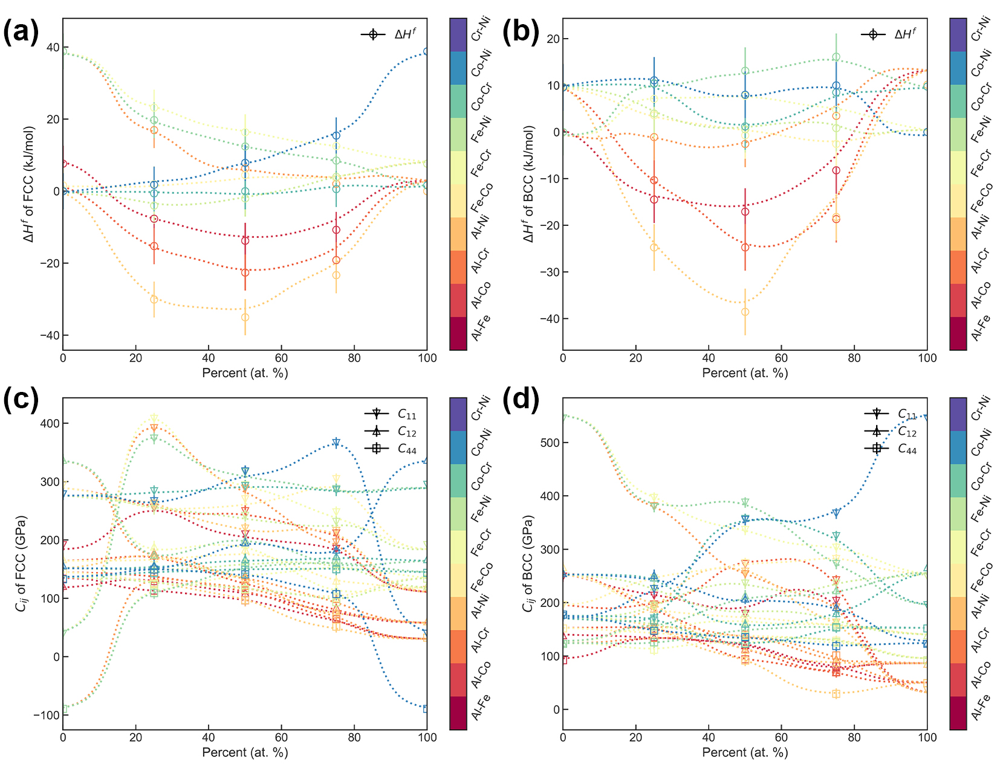
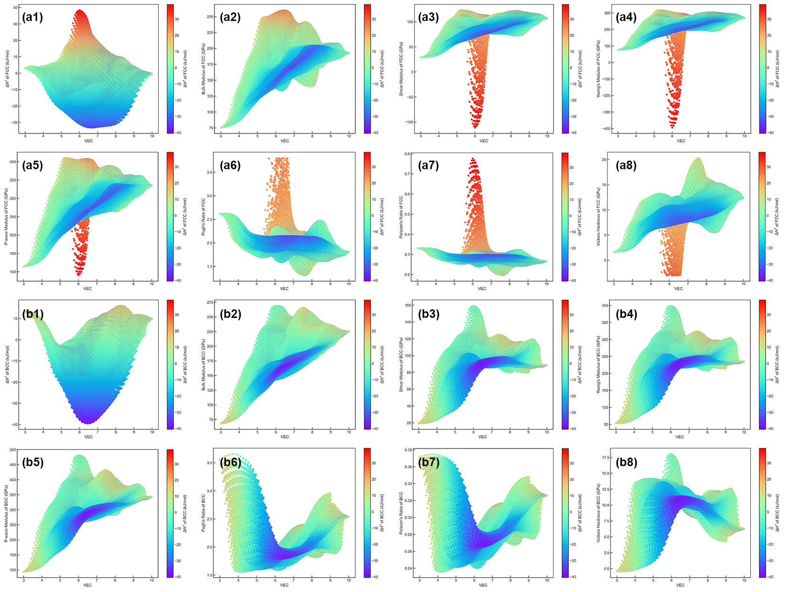
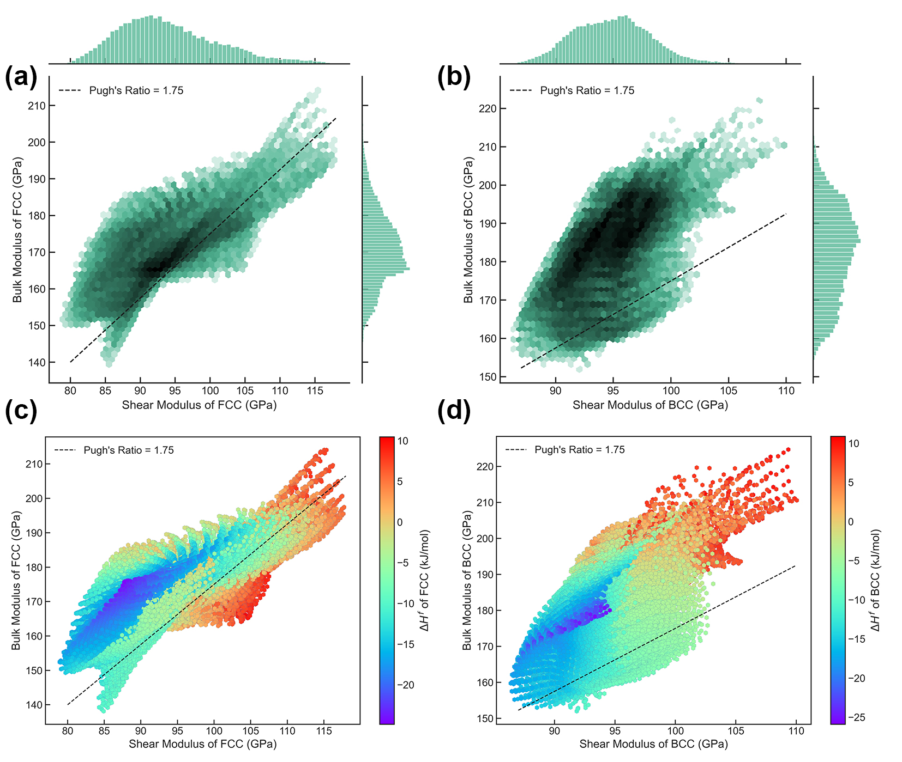
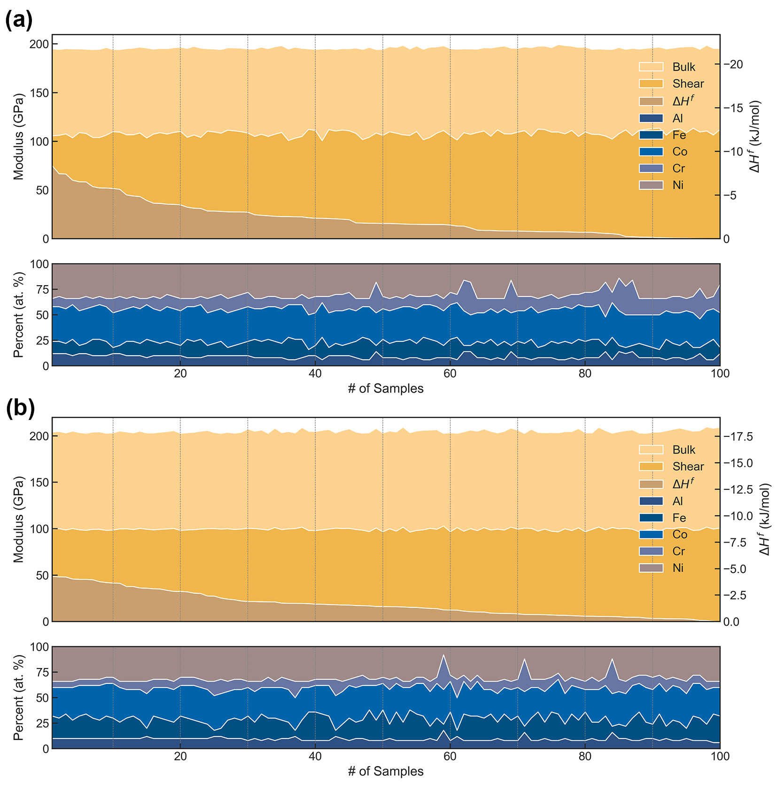

# High-Entropy Materials Design by Integrating the First-Principles Calculations and Machine Learning: a Case Study in the Al-Co-Cr-Fe-Ni System

## Overview
The first-principles calculation is widely used in high-entropy materials. However, this approach may consume many computational resources for complex systems, limiting the construction of property maps for the corresponding materials over a full composition range. In this work, the most common Al-Co-Cr-Fe-Ni system (both FCC and BCC) is selected for our investigation. We formulate a materials design strategy that combines first-principles calculation results and machine learning models to establish a robust database of properties (e.g., phase stabilities and elastic constants): starting from unary, binary, ternary, and quaternary, then extending into high-order systems. Analyzing and screening this database can further inspire discovering and designing new high entropy materials. Moreover, the corresponding software was developed to facilitate the use of related persons or institutions. 

## Workflow
* Above the iceberg:  
The training data of properties (e.g., phase stabilities and mechanical properties) is obtained by the first-principles calculation. The rules lying behind the data can be discovered by machine learning.
* Below the iceberg:  
The knowledge of HEA over a full composition range can be obtained from well-trained model, and the corresponding software is developed with the knowledge embedded.

## Main Results
### Modeling
* This work uses the latest hyperparameter optimization framework, OPTUNA, to perform automated algorithm-driven ML model tuning. The detailed search space of the hyperparameters involved is listed in the table below.

| Objectives | Search space |
| :--- | :--- |
| Trials number | 0 ~ 500 |
| Number of layers | 2 ~ 6 |
| Number of nodes | 100 ~ 300 |
| Learning rate | 0.0001 ~ 0.01 |
| Weight decay | 0.00001 ~ 0.001 |
| Optimizer | Adam, SGD, RMSprop |

* Results of algorithm-driven modeling: (a) optimization history; (b) importance plot for difference hyperparameters; and (c) detailed optimization results based on specific hyperparameters.

### Training

### Prediction

### Analysis

### Screening

## Get Started
### Download
Visit https://github.com/aguang5241/HEA_ML/releases to download the demo version of software (Windows). 
* Note: The demo version of software is only for demonstration purpose. It is not intended for commercial use. For full version of software, please contact us (gliu4@wpi.edu; yzhong@wpi.edu).

### Usage Description
1. On the *Entrance* page, two search modes are available: *Single-Point* and *Advanced*. Press the *START* button to start the search.

2. On the *Single-Point* page, you can calculate the predicted properties based on the exact given concentration.

3. On the *Advanced* page, you can calculate and analyze the predicted properties based on certain given conditions.

## References
1. G. Liu, S. Yang, Y. Zhong. High-entropy materials design by integrating the first-principles calculations and machine learning: a case study in the Al-Co-Cr-Fe-Ni system. In preparation. (2022)
2. S. Yang, Y. Zhong, Ab Initio Modeling of fcc Fe-Co-Cr-Ni High Entropy Alloys with Full Composition Range, Journal of Phase Equilibria and Diffusion 42(5) (2021) 656-672.
3. S. Yang, G. Liu, Y. Zhong, Revisit the VEC criterion in high entropy alloys (HEAs) with high-throughput ab initio calculations: A case study with Al-Co-Cr-Fe-Ni system, Journal of Alloys and Compounds  (2022) 165477.

