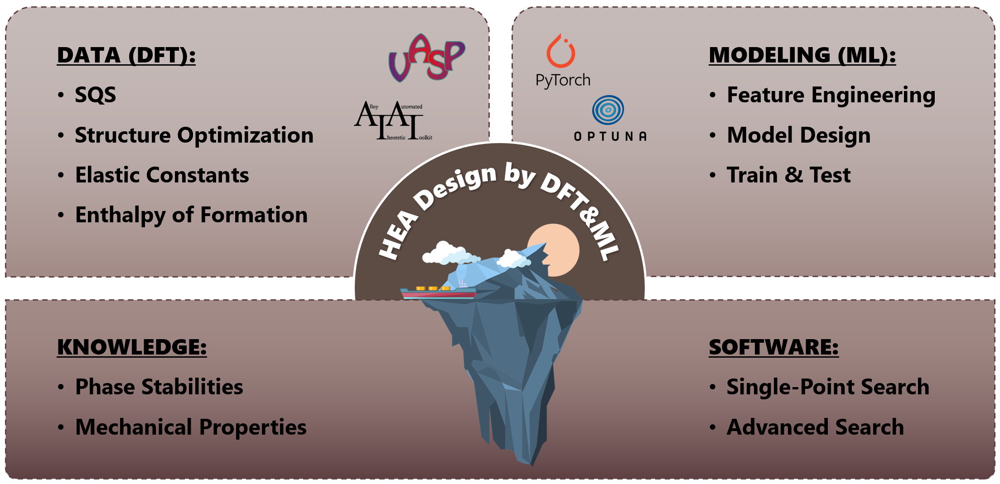
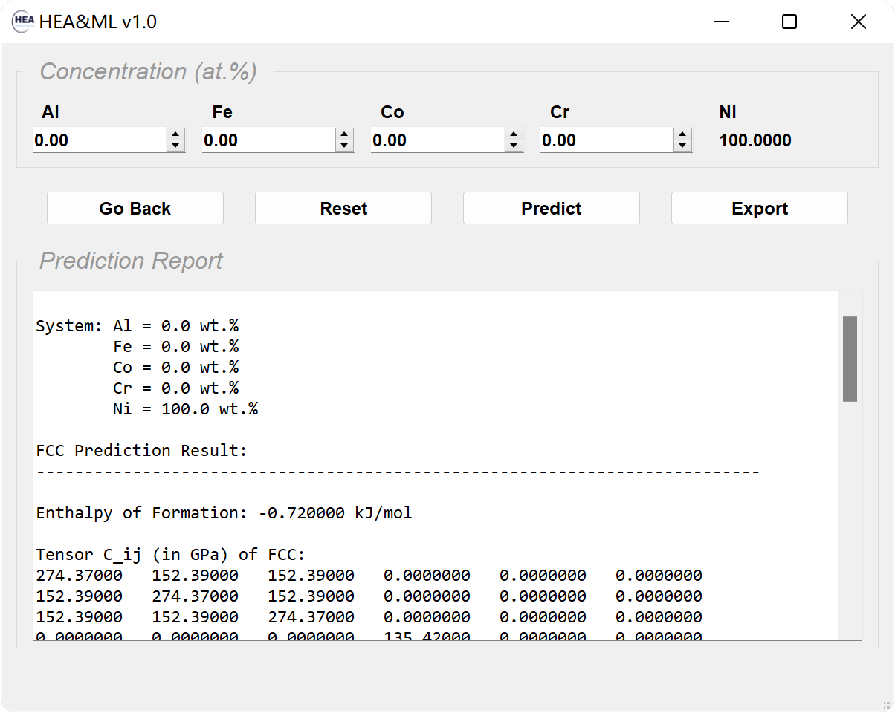
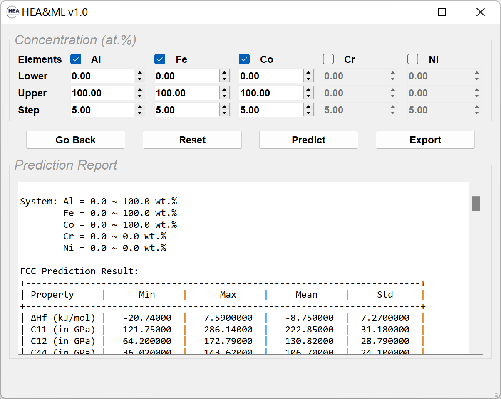

# HEA_ML
The first-principles calculation is widely used in HEA, however, it is not computational friendly for large/complex systems. In this work, the Al-Co-Cr-Fe-Ni system (both FCC and BCC) is selected for our investigation. We formulate a materials design strategy that combines first-principles calculation results and machine learning models to establish a robust database of properties (e.g., phase stabilities and elastic constants). Moreover, we developed the corresponding desktop software to facilitate the use of related persons or institutions. 

## Workflow
* Above the iceberg:  
The training data of properties (e.g., phase stabilities and mechanical properties) is obtained by the first-principles calculation. The rules lying behind the data can be discovered by machine learning.
* Below the iceberg:  
The knowledge of HEA over a full composition range can be obtained from well-trained model, and the corresponding software is developed with the knowledge embedded.

## Get Started
### Download
Visit https://github.com/aguang5241/HEA_ML/releases to download the demo version of software (for Windows). 
* Note: The demo version of software is only for demonstration purpose. It is not intended for commercial use. For full version of software, please contact us (gliu4@wpi.edu; yzhong@wpi.edu).

### Usage Description
1. On the *Entrance* page, two search modes are available: *Single-Point* and *Advanced*. Press the *START* button to start the search.

2. On the *Single-Point* page, you can calculate the predicted properties based on the exact given concentration.

3. On the *Advanced* page, you can calculate and analyze the predicted properties based on certain given conditions.

